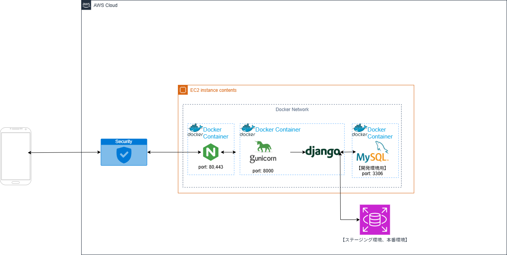

# Socialgame-Text-Backend
ソーシャルゲーム開発ガイドを基にした勉強用リポジトリ

## 1. 概要
  
本プロジェクトは、Djangoを用いたバックエンドアプリケーションです。  
Docker Composeにより開発環境を構築しています。  

---

## 2. 技術構成

開発環境では以下の構成を採用しています。  

- nginx
- Django (gunicorn)
- MySQL
- phpMyAdmin

---

## 3. ディレクトリ構成

BACKEND(root)/
|- app/     #Djangoアプリケーション
|- nginx/   #nginx設定
|- mysql/   #DB初期化スクリプト
|- docker-compose.yml
|- docker-compose.dev.yml
|- docker-compose.prod.yml
|- .env.example
|- LICENSE
|- README.md

## 4. 開発環境
### 4.1 セットアップ


#### 4.1.1 リポジトリの取得

本リポジトリをローカルマシンに取り込みます。  

```bash
git clone <リポジトリURL>
cd <プロジェクト名>
```

#### 4.1.2 環境変数ファイルの作成

**.env.exampl**をコピーして **.env.dev** を作成します。  
環境変数の内容は適宜変更しても構いません。  

```bash(Windows)
copy .env.example .env.dev
```
```bash(Mac/Linux)
cp .env.example .env.dev
```
### 4.2 起動方法


以下のコマンドを用いてDockerコンテナを起動します。  

```bash
docker compose --env-file .env.dev -f docker-compose.yml -f docker-compose.dev.yml up --build
```
### 4.3 アクセス

以下のURLでアプリ、phpMyAdminにアクセスできます。  

- [アプリ](http://localhost)：http://localhost
- [phpMyAdmin](http://localhost:8080)：http://localhost:8080

### 4.4 開発フロー

基本的な開発の流れは以下の通りです。  

1. ローカルでコードを編集
2. Dockerコンテナ上で動作確認
3. 必要に応じてマイグレーションを実行
4. 変更内容をコミット・プッシュ

マイグレーションは以下のコマンドで実行できます。  

```bash
docker compose --env-file .env.dev -f docker-compose.yml -f docker-compose.dev.yml exec app python manage.py makemigrations
docker compose --env-file .env.dev -f docker-compose.yml -f docker-compose.dev.yml exec app python manage.py migrate
```

### 4.5 注意事項

- .env.devや.env.prodはgitリポジトリには含まれていません
- .env.exampleをテンプレートとして使用してください
- 開発環境ではMySQLコンテナを使用しています

## 5. 本番環境、ステージング環境
### 5.1 構成

本プロジェクトの開発環境、本番環境およびステージング環境は、基本的に同一の構成を持ちます。  
各環境の違いは主にデータベースおよび環境変数にあります。  



### 5.2 環境変数

以下の手順で環境変数ファイルを作成してください。  

1. **.env.example** を参考に **.env.prod** を作成  
2. `DEBUG=False` に変更  
3. `SECRET_KEY` を設定  
4. `ALLOWED_HOSTS` を設定  
5. データベース設定を本番用（RDS）に変更  

環境変数ファイルの例
```env
DEBUG=False
SECRET_KEY=your-secret-key
ALLOWED_HOSTS=your-ec2-ip

DB_NAME=socialgame_prod
DB_USER=your_user
DB_PASSWORD=your_password
DB_HOST=your-rds-endpoint
DB_PORT=3306
```

### 5.3 デプロイ手順

本セクションでは、AWS EC2 上にアプリケーションをデプロイする手順を説明します。

また本手順を実行する前に、AWS RDS（MySQL）インスタンスを作成し、  
エンドポイント・ユーザー名・パスワードを確認しておいてください。  
これらの情報は `.env.prod` に設定するために必要です。

#### 5.3.1 EC2インスタンスの作成

以下の要件を満たすEC2インスタンスを作成してください。

- OS：Ubuntu
- セキュリティグループで以下を許可
  - HTTP(80)
  - SSH(22)

#### 5.3.2 EC2にログイン

以下のコマンドでEC2にアクセスしてください。

 ```bash
ssh -i <secret-key.pem> ubuntu@<EC2のIPアドレス>
 ```

#### 5.3.3 アプリのインストール

以下のコマンドを使用し、EC2にDockerおよびGitをインストールしてください。

```bash
sudo apt update
sudo apt install -y ca-certificates curl gnupg

sudo install -m 0755 -d /etc/apt/keyrings
sudo curl -fsSL https://download.docker.com/linux/ubuntu/gpg -o /etc/apt/keyrings/docker.asc
sudo chmod a+r /etc/apt/keyrings/docker.asc

echo "deb [arch=$(dpkg --print-architecture) signed-by=/etc/apt/keyrings/docker.asc] https://download.docker.com/linux/ubuntu $(. /etc/os-release && echo "${UBUNTU_CODENAME:-$VERSION_CODENAME}") stable" | sudo tee /etc/apt/sources.list.d/docker.list > /dev/null

sudo apt update
sudo apt install -y docker-ce docker-ce-cli containerd.io docker-buildx-plugin docker-compose-plugin
```

#### 5.3.4 リポジトリを取得

EC2内でgitリポジトリをクローンしてください。

```bash
git clone <リポジトリURL>
cd <プロジェクト名>
```

#### 5.3.5 環境変数ファイルの作成

以下のコマンドで環境変数ファイルを作成後、手順5.2を参考にし環境変数を定義してください。  

```bash
nano .env.prod
```

#### 5.3.6 コンテナの起動

以下のコマンドでアプリケーションを起動します。

```bash
docker compose --env-file .env.prod -f docker-compose.yml -f docker-compose.prod.yml up -d --build
```

#### 5.3.7 動作確認

ブラウザで以下にアクセスしてください。

```text
http://<EC2のIPアドレス>
```

## 6. 注意事項

- この手順ではhttpsは使用できません。